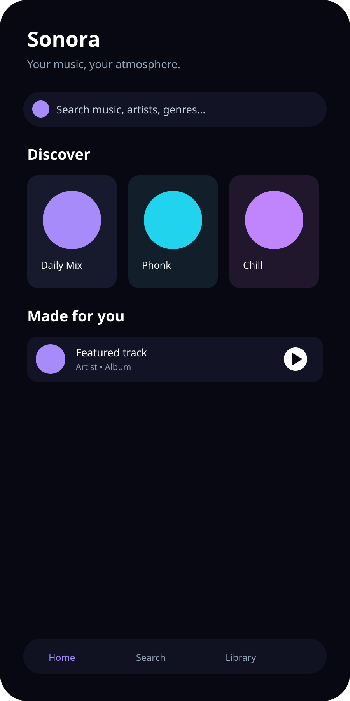
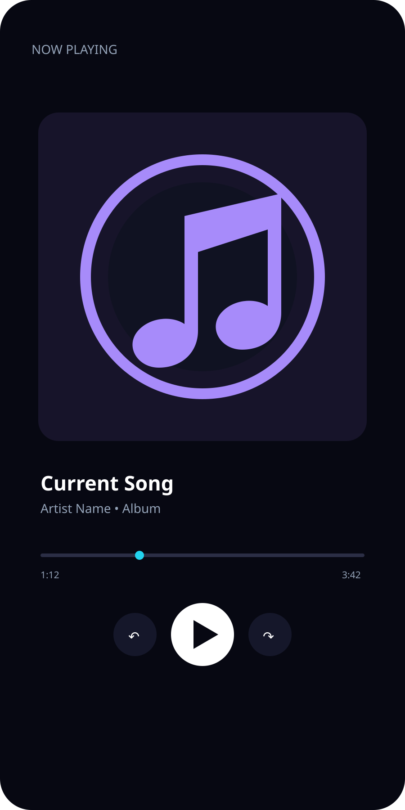
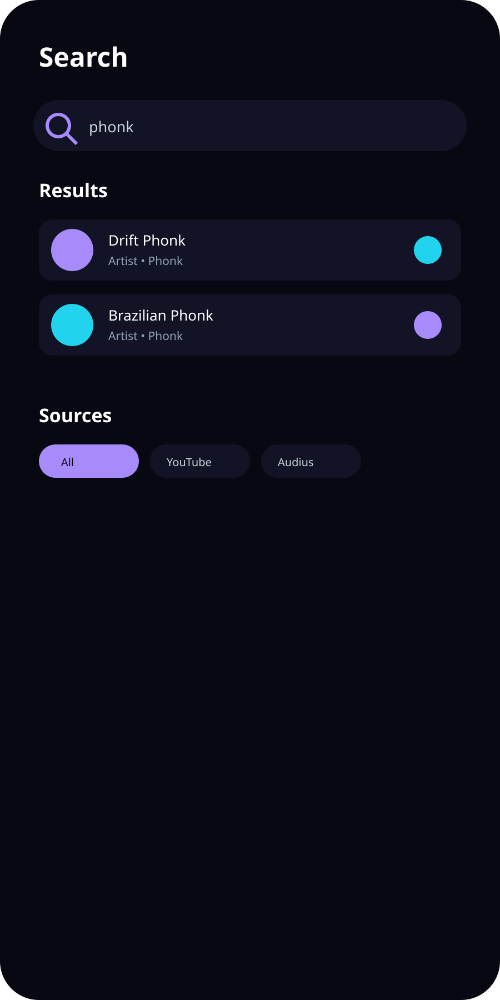
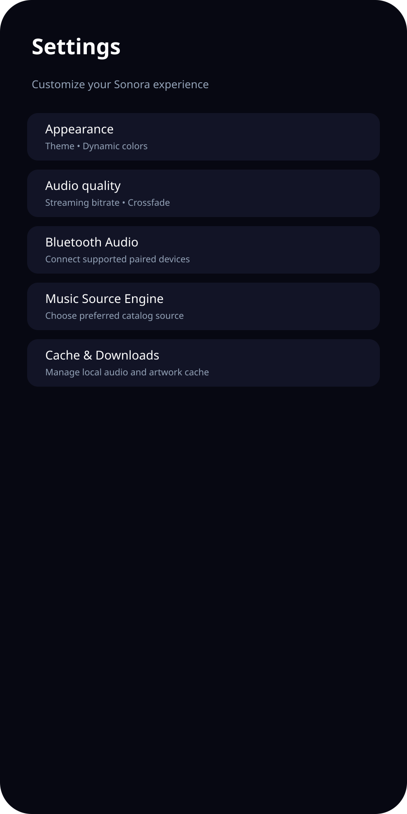
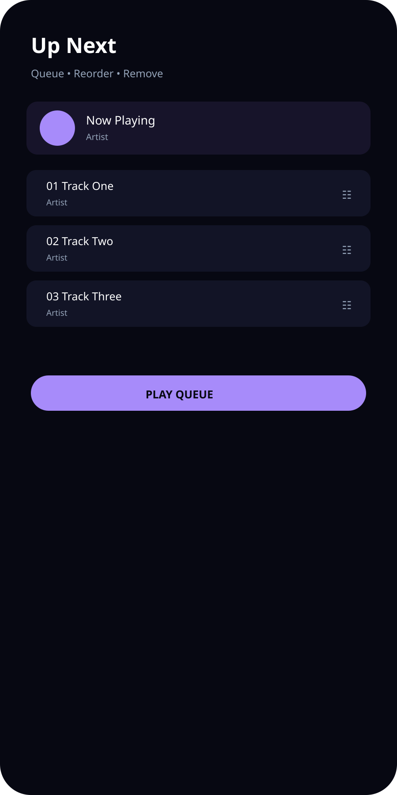

# 🎵 Sonora 2.0

<div align="center">


**A modern native Android music player focused on discovery, playback, playlists, offline listening and a polished dark UI.**


</div>

---

## 📱 About

Sonora is a **native Android application** built for a clean, immersive music experience. It combines Jetpack Compose, AndroidX Media3 playback, Room local storage, DataStore preferences, provider-based discovery, playlists, downloads, lyrics, smart mixes and background playback.

- **Version:** 2.0
- **Application ID:** `com.aistudio.sonora.mvstkd`
- **Minimum Android:** API 24
- **Target / Compile SDK:** 36

> Sonora does not bundle a complete commercial music catalog. Track availability depends on configured providers and their licensing/usage rights.

---

## 📸 App previews

Six documentation previews are included in the repository:

<table>
<tr>
<td></td>
<td></td>
<td></td>
</tr>
<tr><td align="center"><b>Home</b></td><td align="center"><b>Now Playing</b></td><td align="center"><b>Search</b></td></tr>
<tr>
<td></td>
<td></td>
<td></td>
</tr>
<tr><td align="center"><b>Library</b></td><td align="center"><b>Settings</b></td><td align="center"><b>Queue</b></td></tr>
</table>

> These are repository UI preview assets for documentation, not claims of device screenshots.

---

## ✨ Main features

### 🎧 Playback
- AndroidX Media3 ExoPlayer
- Background playback with `MediaSessionService`
- Play / pause / seek / next / previous
- Queue management and reordering
- Shuffle and repeat
- Crossfade
- Sleep timer
- Playback progress tracking
- Current-track title, artist, album and artwork metadata
- Android system / lock-screen media controls

### 🔎 Discovery
- Multi-source music discovery
- Provider-based search
- Recent searches
- Genre discovery
- Dedicated **🔥 Phonk** category
- Smart mix / recommendation-oriented flows
- Configurable source selection

### 📚 Library
- Favorites / liked tracks
- Listening history
- Playlists
- Offline downloads
- Local track status
- Queue and library organization

### ⚙️ Personalization
- Material 3 dark-first interface
- Theme mode
- Dynamic colors
- Streaming quality
- Crossfade and audio settings
- Equalizer preset integration
- Loudness normalization
- Language / regional focus
- Audio and artwork cache
- Bluetooth audio support

---

## 🧩 Technology stack

| Area | Technology |
|---|---|
| Language | **Kotlin** |
| UI | **Jetpack Compose + Material 3** |
| Navigation | Jetpack Navigation Compose |
| Playback | **AndroidX Media3 / ExoPlayer** |
| Background audio | **Media3 MediaSessionService** |
| Database | **Room** |
| Preferences | **Jetpack DataStore** |
| Networking | **Retrofit + OkHttp** |
| JSON / models | **Kotlin Serialization + Moshi** |
| Images | **Coil** |
| AI | Firebase AI SDK integration |
| Build | **Gradle + Android Gradle Plugin** |
| CI | **GitHub Actions** |
| Java | **JDK 17** |

### Build environment

- JDK 17
- Android SDK 36
- AGP 9.1.1
- Gradle 9.3.1

---

## 🎵 Background music

Sonora uses a real AndroidX Media3 `MediaSessionService` instead of a fake in-app player.

When music is playing, the playback service can remain active while the app is backgrounded. Android can expose the active media session through its system media controls, using the current track's metadata and artwork.

---

## 🌐 Music sources

The project is designed around provider catalogs and currently contains/configures sources such as:

- YouTube
- Audius
- Jamendo
- Free To Use

Free To Use integration uses its public API:

`https://api.freetouse.com/v3/`

Example routes:

- `/music/tracks/all`
- `/music/tracks/search`
- `/music/tracks/{id}`

Provider availability and licensing can change. Always check current provider terms before publishing or monetizing the application.

**Sonora does not claim to provide every commercial song in the world.**

---

## 🛠️ Build locally

### Requirements

- Android Studio
- JDK 17
- Android SDK 36
- Android device or emulator
- Values required by `.env.example` for integrations that need them

### Steps

1. Clone the repository.
2. Open it in Android Studio.
3. Let Gradle sync.
4. Configure environment values when required.
5. Build and run the `app` module.

### GitHub Actions

Build workflow:

`.github/workflows/build.yml`

The workflow produces the Android APK and source artifacts.

---

## 🗂️ Project structure

```text
sonora/
├── app/
│   └── src/main/
│       ├── java/                 # Kotlin source
│       └── res/                  # Android resources / launcher
├── docs/
│   ├── app-icon.svg              # README app icon
│   └── screenshots/              # 6 UI preview assets
├── .github/workflows/
│   └── build.yml                 # CI / APK build
├── CREDITS.md
├── LICENSE
├── SONORA_UPGRADES.md
├── metadata.json
└── README.md
```

---

## 🔐 Android permissions

Depending on enabled features and Android version, Sonora uses permissions for:

- Internet / network state
- Foreground media playback
- Notifications
- Bluetooth audio
- Vibration
- Wake lock

These permissions enable Android features; they do not grant rights to third-party music catalogs.

---

## 🧪 Project status

**Sonora 2.0** is an actively evolving project.

The current upgrade includes the Media3 background playback architecture, multi-source discovery, library and download management, settings/theme controls, Bluetooth-related support and the dedicated Phonk category.

Builds are validated through GitHub Actions.

---

## 📄 License & credits

See [LICENSE](LICENSE) for licensing information and [CREDITS.md](CREDITS.md) for third-party libraries, providers and attribution.

---

<div align="center">

**Sonora 2.0 — Music, without the noise. 🎵**

</div>
